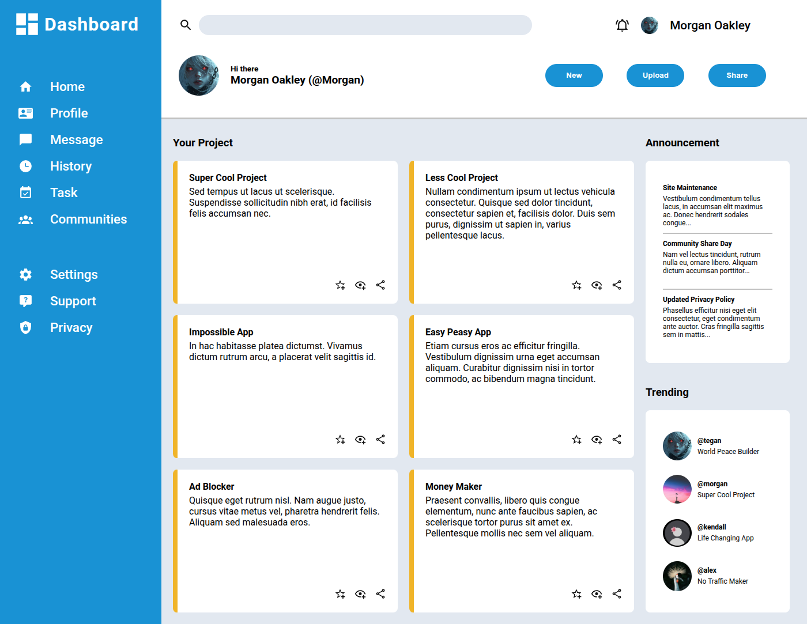

# Admin Dashboard

A fully responsive admin dashboard built with HTML and CSS Grid as part of [The Odin Project](https://www.theodinproject.com/) curriculum.

## 🚀 Live Demo

[View Live Demo](https://topkjames.github.io/odin-admin-dashboard/)

## 📋 Features

- **Responsive Layout** — Adapts seamlessly to any screen size
- **CSS Grid Mastery** — Complex grid layouts with `auto-fit` and `minmax`
- **SVG Icon System** — Clean, scalable icons using `<symbol>` and `<use>`
- **Clean Design** — Professional color scheme with Roboto typography
- **Interactive Elements** — Hover effects and button interactions

## 🛠️ Built With

- HTML5
- CSS3 (Grid, Flexbox)
- SVG Icons
- Google Fonts (Roboto)

## 📁 Project Structure

odin-admin-dashboard/
├── index.html # Main HTML file
├── dashboard.css # All styles
├── assets/
│ ├── svgs/ # SVG icons
│ └── images/ # Profile and UI images
├── README.md # This file
└── LICENSE # MIT License

## 🎯 Learning Outcomes

Through this project, I:

- Mastered CSS Grid for complex layouts
- Created a reusable SVG icon system with `<symbol>`
- Built a fully responsive dashboard
- Applied professional Git practices
- Deployed to GitHub Pages

## 🙏 Acknowledgments

- [The Odin Project](https://www.theodinproject.com/) for the curriculum and inspiration
- [Material Design Icons](https://materialdesignicons.com/) for SVG icons
- [Google Fonts](https://fonts.google.com/) for Roboto typography

## 📄 License

This project is open source and available under the [MIT License](LICENSE).

---

Built with ❤️ by [Topk James](https://github.com/Topkjames)